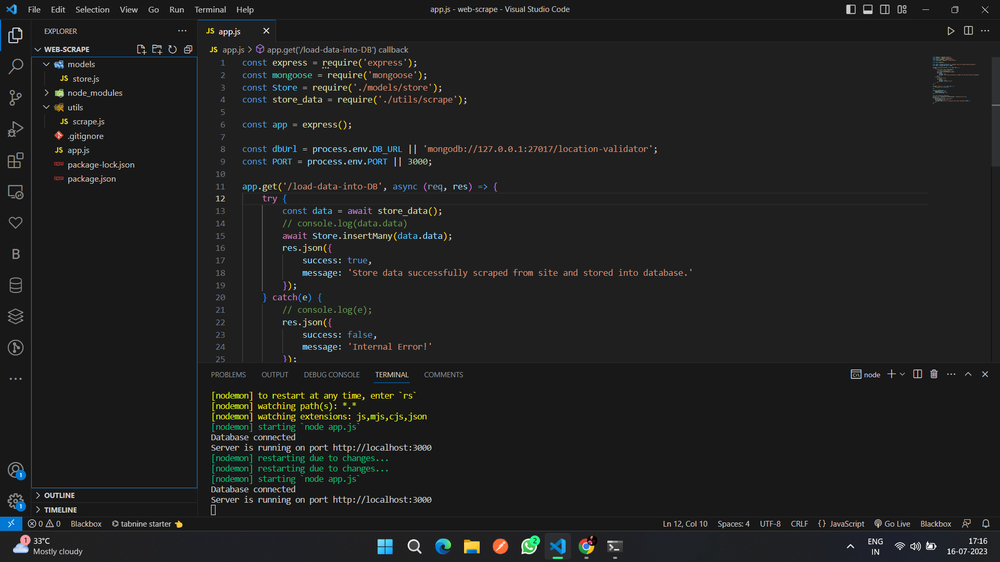
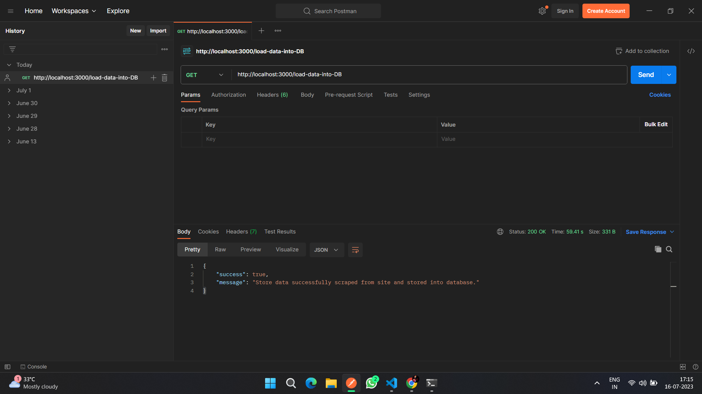
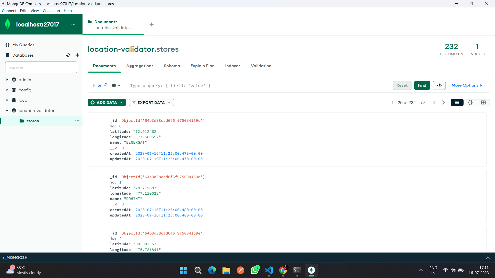

# Location Validator App

### How to run the project

* Go to [https://github.com/absk07/webscrape01](https://github.com/absk07/webscrape01)
* Clone the project or download the zip and extract it.
* Open the project in VS Code or any code editor of your choice.
* Open a new terminal in your editor and run the command `npm install` to install all the required dependencies.
* After the intallation is done, run another command `npm start` to start the server.
* Now you can goto the url `http://localhost:3000/load-data-into-DB` to load the scraped data into the database.

### Screenshots

#### Note

* Make sure Node.js is already installed into your system.
* Make sure mongodb is already installed into your system.
